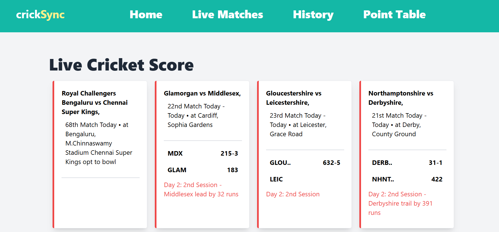
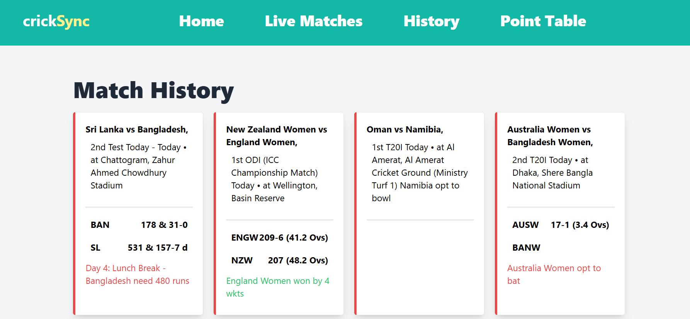
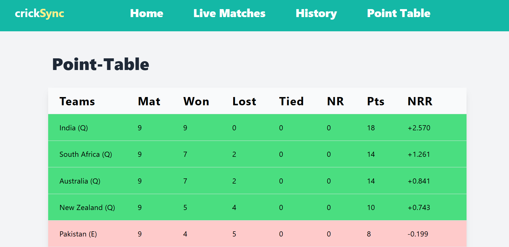

# CrickSync

CrickSync is a web application developed using Spring Boot and Angular. It provides real-time updates, live scores, match schedules, and team coordination for cricket enthusiasts.

## Screenshots

### Homepage

### Live Cricket Score

### History

### Point-Table

## Features

- **Real-time Updates:** Get the latest updates and scores in real-time as the cricket matches progress.
- **Live Scores:** Stay updated with live scores of ongoing matches.

## Technologies Used

- **Frontend:** Angular
- **Backend:** Spring Boot
- **Real-time Updates:** WebSocket
- **Database:** MySQL/PostgreSQL (or any other supported by Spring Data JPA)
- **Authentication:** JWT (JSON Web Tokens)

